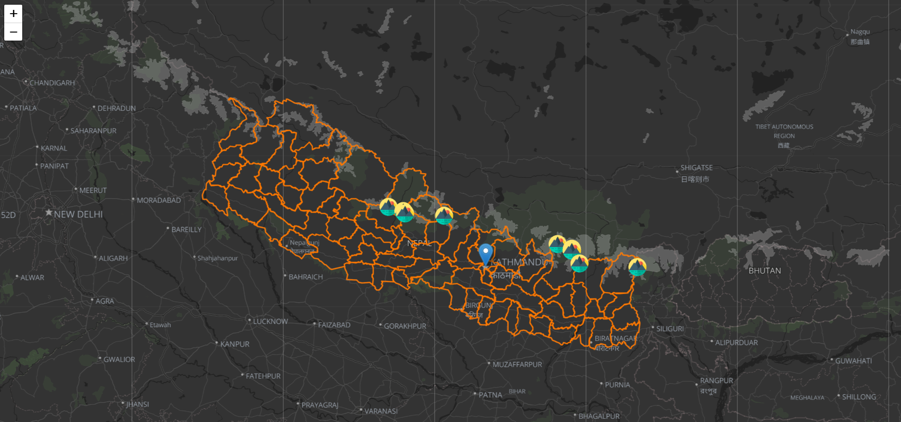
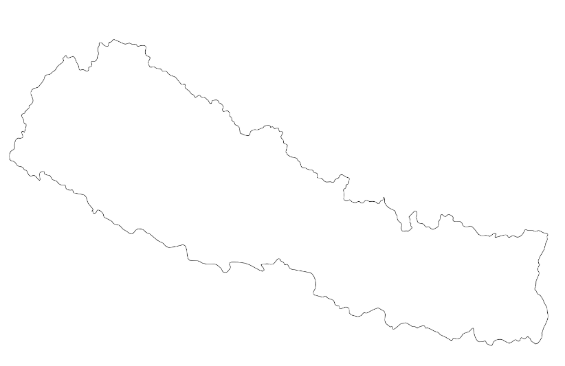

This web page displays the map of Nepal using leaflet. The purpose of this exercise was to gain more familiarity with a different client side library than what we were assigned to in the class. 

### Wireframe

### Learning outcomes
- I learned to use different tiles with leaflet
- Learned to use markers with popup and image embeddings
- Gained familiarity with GeoJSON data
- Learned to use GeoJSON data with leaflet

