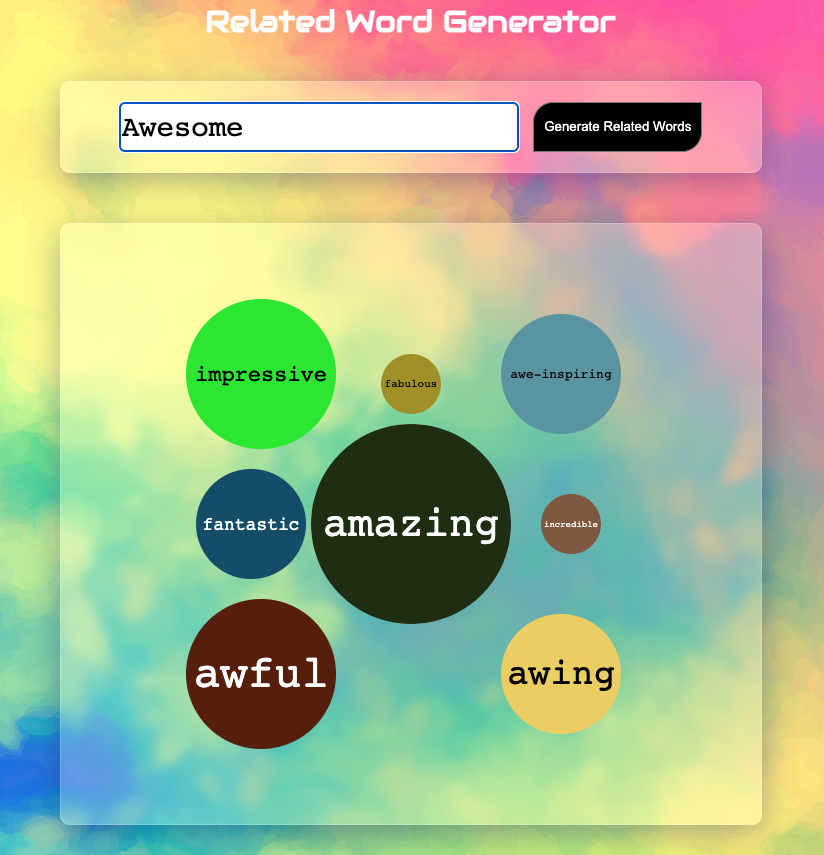
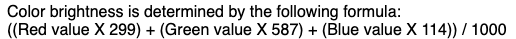

Wireframe: https://www.figma.com/file/XiMYzaNuJd370IXGqldcJF/Untitled?node-id=1%3A2

Live version: https://bordernone.github.io/ConnectionsLab/Project1/

### Description

The idea is to create something similar to "word cloud" that displays words that are related to the phrase/word that user types. It can be used for multiple purposes. Essentially, this API processes four major queries: for a given input X, one can find words that are similar to X, words that sound like X, words that are spelled like X, or words that are related to X. Use of wildcard, prefix, suffix are few extensions to this API. Furthermore, the words have a score associated with them which tells how the word is related to the user's entered text.

For my project, I use the default parameters without any wildcard for generating words that are similar to the text the user inputs. The words are already ranked based on their score when fetched from the API so I do not have to sort it.

API: https://api.datamuse.com

### Challenges

##### Animating Bubble

-   Animating the bubles was the most challenging part for me since I needed to make the bubbles "grow" independently of each other.
-   Shrinking the bubble was another difficulty I faced. I needed to reduce the radius of the cicle on every iteration but my background wasn't transparent so, at first, it didn't quite look like the bubble was shrinking.

Solution: Setting bubble's lifecycle. I used a parameter for the Bubble object called "LifeCycle"; the lifecycle of a bubble could take one of the three values: "null" (the bubble is growing), "live" (the bubble has grown to its max size), "dying" (the bubble is shrinking). This enabled me to run async function based on the lifecycle of the bubble independently of the other bubbles.

##### Dynamic Coloring

-   I decided to spawn bubbles with randomly selected colors. Creating random colors for every bubble and doing it again for every iteration would have made the code look unclean.
-   Choosing color of the text based on background was also a challenge since it'd make it difficult to read light colored text on light background and vice-versa.

Solution: I created a colors class which has many helpful function: generateRandomColor (returns a random red, green, blue combination without repeating), textColor (returns the color of the text depending upon the background), etc. The most interesting function is textColor that takes a rgb combination and returns the appropriate text color. The function uses a formula from [this](https://www.w3.org/TR/AERT/#color-contrast) page to compute the appropriate intensity of the background. Whent he intensity if above threshold, it returns white otherwise it returns black.

### Note
- You might have noticed that I do not sort the words based on the scores. This is because the words are already sorted based on their score when fetched from the API.

### Usage Guide
1. User enters a word or phrase in the input field.
2. User clicks the generate button.
3. The webpage generates a grid displaying the words.
4. The size of the bubble is directly proportional to the similarity score of the word in the bubble
5. User can click on different bubbles to find words related to the word they clicked on.

### Status

-   [x] Initialize the project with an html, a javascript, and a css file.
-   [x] Add input field and buttons.
-   [x] Fetch data from the api and process the response (also display).
-   [x] Use p5js to display array of words as word cloud and set their size and color according to the word's score.
-   [ ] Make the bubbles dynamic (currently, it is statically mapped to the canvas)
-   [ ] Increase the size of the grid.

### Ideas that could be implemented in the future

-   [ ] User can select words from word cloud and export it as a file
-   [ ] Make mobile friendly

### Resources

- https://api.datamuse.com
- https://www.w3.org/TR/AERT/#color-contrast
